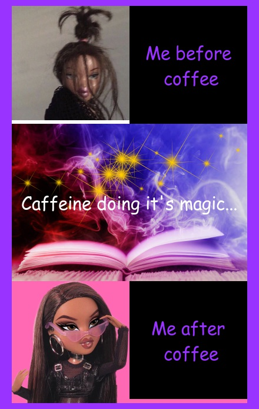

# Welcome to my GitHub Page!

This course has been my first introduction to writing in code languages and GitHub.

## A little bit about me

I am a Commerce and Arts conjoint student and am currently in my 4th year here at the University of Auckland. 

Outside of Univeristy, I have a part time job (*shameless plug for [HOYTS](https://www.hoyts.co.nz)*) and have a passion for playing detective 🔍 when watching true crime shows and podcasts. 


## My Meme

I have attached the meme I created for my **stats220 course** the package [{magick}](https://cran.r-project.org/web/packages/magick/vignettes/intro.html). 



I used R code to create my meme in R Studio. R Studio is a free to download software so click the [link](https://www.rstudio.com/products/rstudio/download/) if you are interested in downloading to see how my code creates a meme or to make a meme of your own. 

**A quick explanation of steps in creating my meme**
1. Imported the three pictures I knew I wanted to use (disheveled barbie, spell book photo, glam barbie)
2. Created black caption boxes for barbie photos
3. Imported a picture of sparkles to layer on top of the spell book photo, then captioned this picture too
4. I created vectors with the barbie pictures and the corresponding black caption box
5. Appended these vectors as rows and stacked them on top of each other vertically to create the meme
6. Added a border around the meme
7. Saved the meme as a .png

My R code is as follows; 
```{r my_meme)
#import and scale images for meme and save under easy-to-remember names
tired_barbie <- image_read("https://s11.favim.com/orig/7/718/7180/71809/funny-crazy-memes-Favim.com-7180974.jpg"
) %>% image_scale(200)

glam_barbie <- image_read("https://cdn131.picsart.com/312785891255211.png"
) %>% image_scale(200) %>% image_background("hotpink")

magic_pic <- image_read("https://media.istockphoto.com/photos/open-book-with-magic-light-and-colored-smoke-picture-id1188168701?k=20&m=1188168701&s=612x612&w=0&h=FxXr2klRFDaMYCsglo2yBJD_1OitPKbRJ3bW9rAwSuY="
) %>% image_scale("400") 

#create boxes to annotate with captions
tired_box <- image_blank (width = 200,
                          height = 200,
                          color ="#000000") %>% image_annotate(text="Me before\n coffee",
                                                               color = "#9933ff",
                                                               size = 30,
                                                               font = "Comic Sans MS",
                                                               gravity = "center")

glam_box <- image_blank (width = 200,
                         height = 200,
                         color ="#000000") %>% image_annotate(text="Me after\n coffee",
                                                              color = "#9933ff",
                                                              size = 30,
                                                              font = "Comic Sans MS",
                                                              gravity= "center")

#layer sparkles on top of magic image

sparkle_pic <- image_read("https://www.onlygfx.com/wp-content/uploads/2018/09/5-gold-sparkle-4.png"
) %>% image_scale(400)

magic_layered_vector <-c(magic_pic, sparkle_pic)
magic_layered <- image_mosaic(magic_layered_vector)


#annotate middle magic image 

annotatedmagic_pic<-image_annotate(magic_layered, text="Caffeine doing it's magic...",
                                   color = "#ffffff",
                                   size = 30,
                                   font = "Comic Sans MS",
                                   gravity= "center")

#stack rows on top of each other
tired_vector <- c(tired_barbie,tired_box)
top_row <-image_append(tired_vector)

glam_vector <- c(glam_barbie,glam_box)
bottom_row <- image_append(glam_vector)

magic_row<-image_append(annotatedmagic_pic)

final<-c(top_row, magic_row, bottom_row) %>%
  image_append(stack=TRUE)

#add border 
border_final <-image_border(final, "#9933ff", "20x10")

#save meme
image_write(border_final, "my_meme.png")
```


**Inspiration behind my meme**
- I knew I wanted to make a meme about coffee, as anyone close to me knows how coffee is a central aspect of my personality lol
- I can't function without a coffee in the morning, so I wanted to play on the fact that caffeine is the magic potion that turns me from a mess to presentable in the morning.
- The meme format I used is common with the picture alongside a black caption box, but I wanted to break up this format slightly by adding the longer picture in the middle. I used the disheveled barbie picture which I've seen before in memes and then I searched for a glamorous barbie to emphasise the extent of the transition caffeine enables. 


